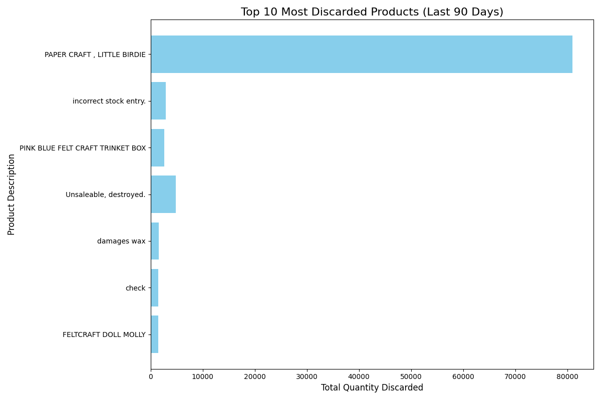

# Product Discard Analysis Project

## Overview
A data analysis project that identifies the top 10 most discarded products in the last 90 days from retail transaction data. This project demonstrates data manipulation, analysis, and visualization skills using Python.

## 🎯 Business Problem
Understanding which products are frequently discarded/returned helps businesses:
- Identify quality issues
- Reduce waste and financial losses
- Make informed inventory decisions
- Improve product selection strategies

## 🛠️ Technologies Used
- **Python 3.x**
- **Pandas** - Data manipulation and analysis
- **Matplotlib** - Data visualization
- **OpenPyXL** - Excel file handling

## 📁 Project Structure
```
├── analyze_data.py                    # Data processing and analysis script
├── create_visualization.py            # Visualization generation script
├── final_product_analysis.csv         # Processed data output
├── discarded_products_trend.png       # Final visualization
├── requirements.txt                   # Python dependencies
└── README.md                          # Project documentation
```

## 🔄 Workflow

### Step 1: Data Analysis (`analyze_data.py`)
1. **Load Data**: Reads retail transaction data from Excel file
2. **Filter Time Period**: Extracts last 90 days of transactions
3. **Identify Discards**: Filters negative quantities (returns/discards)
4. **Calculate Frequency**: Groups by product and sums discard quantities
5. **Extract Brand**: Parses brand name from product description
6. **Export Results**: Saves processed data to CSV

**Input**: `Online Retail.xlsx`  
**Output**: `final_product_analysis.csv`

### Step 2: Visualization (`create_visualization.py`)
1. **Load Processed Data**: Reads the CSV from Step 1
2. **Select Top 10**: Filters the most discarded products
3. **Create Chart**: Generates horizontal bar chart
4. **Save Image**: Exports visualization as PNG

**Input**: `final_product_analysis.csv`  
**Output**: `discarded_products_trend.png`

## 📊 Sample Output



The chart shows the top 10 products with the highest discard rates, making it easy to identify problem items at a glance.

## 🚀 How to Run

### Prerequisites
```bash
pip install pandas matplotlib openpyxl
```

Or install from requirements file:
```bash
pip install -r requirements.txt
```

### Execution Steps
1. Place `Online Retail.xlsx` in the project directory
2. Run the analysis script:
```bash
   python analyze_data.py
```
3. Run the visualization script:
```bash
   python create_visualization.py
```
4. View the generated `discarded_products_trend.png`

## 📈 Key Insights

The analysis revealed:
- Top discarded products in the last 90 days
- Discard frequency patterns
- Product categories with highest return rates

This data-driven approach enables businesses to:
- Investigate root causes of returns
- Optimize inventory management
- Improve product quality control

## 💡 Skills Demonstrated
- Data cleaning and preprocessing
- Time-based data filtering
- Aggregation and grouping operations
- Data visualization best practices
- Python scripting and automation
- Business intelligence analysis

## 👤 Author
Shivansh Sonwani

## 📧 Contact
- LinkedIn: www.linkedin.com/in/shivanshsonwani
- Email: shivanshsonwani5@gmail.com


---

**Note**: The original dataset used in this project is the "Online Retail" dataset. For privacy reasons, the actual data file is not included in this repository.
